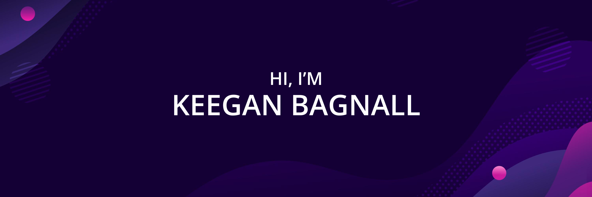

# 👋Hey There!

I’m Keegan, a full-stack engineer, creative coder and self-proclaimed designer who specializes in front-end development. I make it my mission to translate user-focused designs into pixel-perfect websites or applications that run blazing fast.

Want to know more about me? [Check out my portfolio.](https://www.keeganbagnall.com/)

# 📌 Pinned Repositories
 

 

 
  
# My Top Technologies

    

 

# 🌱 What I'm up to:

I am currently working on diving deeper into the world of React, as I would like to specialize within it. I have been creating some projects in my free time to extend my knowledge on hooks and custom components.

# 📫 How to reach me:

Email: keeganbagnall@gmail.com

[Check out my LinkedIn.](https://www.linkedin.com/in/keegan-bagnall/)

[Check out my portfolio.](https://www.keeganbagnall.com/)

